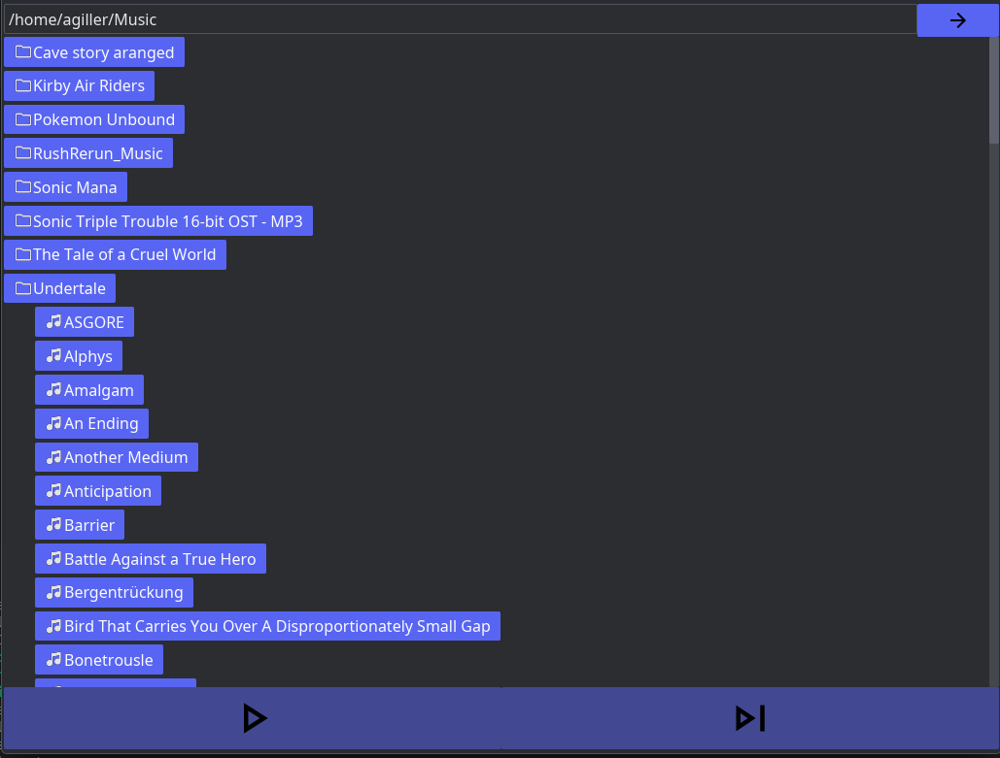

# Music Player

My first Rust GUI project

Currently selected folder is saved to folder.txt so it stays when you restart the program 

## Compile and run yourself

1. Install rust from https://rust-lang.org/tools/install/ if you havent already 
2. Clone Repository with `git clone https://github.com/Emarald64/music-player.git`
3. Run `cargo run -r`

## Things used

* Icons - [Google Materal Icons](https://fonts.google.com/icons)
* Sound playing library - [Rodio](https://github.com/RustAudio/rodio)
* GUI library - [Iced](https://iced.rs/)